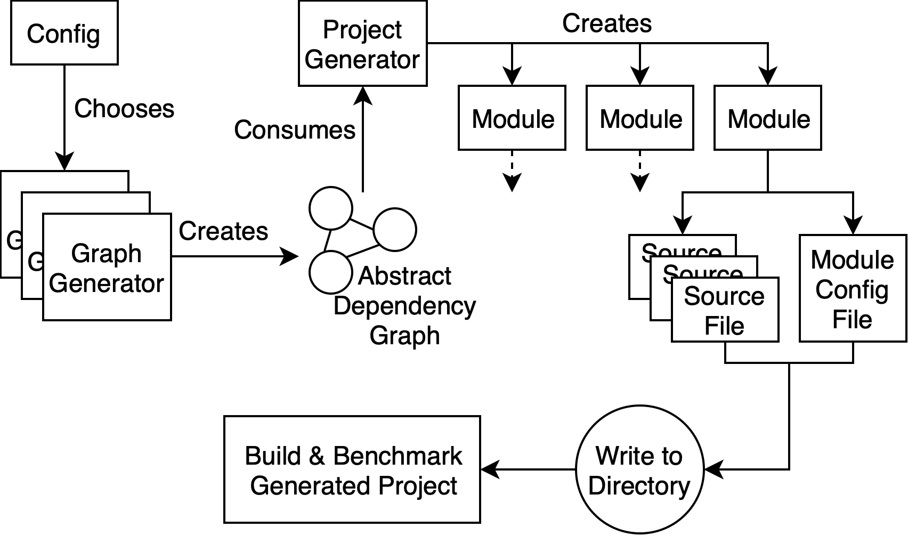

# Pear Poet

## Description

This python app makes mock Xcode Swift app projects with [BUCK](https://buckbuild.com/).  It lets us test different swift module configurations to see how much build speed is affected by different [dependency graphs](docs/layer_types.md) with identical amounts of code.  There are two main command line apps:

* `genproj.py` which generates one app which you have to build manually yourself.  Either with BUCK or xcodebuild.
* `multisuite.py`, which generates all module configs, builds them, records how long they take to build into a CSV and outputs it's results to a directory passed in the command line.  Essentially a benchmark test suite.  Can take several hours to run depending how many lines of code each app takes.

This app was architected so other languages, graph generators or build systems wouldn't be much work to add.  Theoretically you could extend this app to generate java gradle android apps with the same [dependency graph types](docs/layer_types.md).

## How to Install / Dependencies

With a mac computer that can run macOS 10.13+, install all the dependencies below:

* macOS 10.13.X+, untested on older versions.
* Python 2.7.X (pre-installed on macOS 10.13+)
* Xcode command line tools & Xcode
   * Install with: `xcode-select --install` / [The mac app store](https://itunes.apple.com/us/app/xcode/id497799835)
* [BUCK for xcode project generation](https://buckbuild.com/)
	* [Install instructions](https://buckbuild.com/setup/getting_started.html)
* Optional:  [cloc (Count Lines Of Code)](https://github.com/AlDanial/cloc)
   * Install with [homebrew](https://brew.sh): `brew install cloc`

Then download this project into a folder and run `genproj.py` or `multisuite.py` via the Terminal app.

## How to Use

See `./genproj.py -h` or `./mulisuite.py -h` for general help.  Also take a look at the shell scripts in `examples/shell_scripts` to see examples on how to use these command line programs.

## How we Develop

* We used [Visual Studio Code](https://code.visualstudio.com) at first, but then moved to [pycharm](https://www.jetbrains.com/pycharm/) because of it's code inspector, richer refactor tools and less configuration required to do basic things like testing.
* All new code should add types when appropriate.  Types were added to help with a few refactors.
* It's a goal to eventually move this code base to python 3, probably when python 2.7 won't be maintained anymore after 2020.

* pytest for running tests, basic unittest for writing tests
* yapf for formatting
* isort for sorting imports
* flake8 & pylint for linting
* pycharm's code inspector

## Possible Future Improvements

* Add simulation enhancers if the the mock app isn't good enough in simulating the build speed of large applications.
  * Make Objective-C modules as part of the mock app generation to better simulate a mixed app 
  * Add chokepoint build modules, simulating something similar to some large modules in Uber's apps.
  * Make codegen actually call functions in other modules and inside the module.
  * Additions to dot graph mode, using cloc's sqllite3 output:
      * Query the sqllite3 db that cloc generates to make the mock modules the same size as the real app's modules
      * Afterwards modify the generated mock app to see what causes slowdowns or speedups.
  * Research what the poor points of the swift compiler is and sprinkle that into the codegen. Some ideas:
      * Large math expressions
      * Make the code gen classes overload the `+` operator everywhere per class to make the type checker go wild.
      * Research more possibilities
  * Import apple libraries, use them.
  * Import third party libraries from the cocoapods repo, use them some how.

* Add more project config support:
  * Add swift project manager project description support to remove buck dependency.
  * Test / add bazel support to see if there is any difference between buck or bazel
  * (relatively more work) add direct xcode project & workspace direction

## Basic App Architecture

If you were to summarize Pear Poet as some python pseudocode:

```python
def make_project(config):
    abstract_dependency_graph = config.graph_generation_function(config.project_generation_options)
    swift_file_maker = SwiftFileGenerator()
    project_gen = BuckProjectGenerator(swift_file_maker)
    project_gen.generate_project_from(abstract_dependency_graph)
    project_gen.write_to_folder(config.output_path)
    
def multisuite(config):
    original_state = save_xcode_state()
    
    for xcode_config in config.xcode_configs:
        set_xcode_state(xcode_config)
        
        for gen_func in config.graph_generation_functions:
            proj_config = ProjectConfig(gen_func, join(config.output_path, gen_func.name)
            make_project(proj_config)
            
            trace = TimeAndCPUTracer().start()
            build_project(proj_config)
            trace.stop()
            
            trace.append_result_to_csv(config, proj_config)
            
    set_xcode_state(original_state)
```



Generating a mock app consists of 3 parts:

* Generating an abstract module dependency graph that represents the mock app. (`ModuleNode` in `moduletree.py`)
* Feeding this graph into a build description generator (ex: `BuckProjectGenerator` in `projectgen.py`), which creates project config files.
* And the build description generator using a file generator (ex `SwiftFileGenerator` in `filegen.py`) creating mock code files.
* And then writing all these files into a tree of folders

Most variation & configuration is shown in the graphs that the graph generation functions create.  So the if command line says there are 50 modules or 100 modules with a [`bs_layered`](docs/layer_types.md) graph type, that will show up in the generated abstract graph. 

`GenProjCommandLine` from `genproj.py` is the UI that the user's configuration for generating a mock app is passed into the above process.

`CommandLineMultisuite` from `multisuite.py`, does the same thing as `genproj.py`, but with a list of project generators, and builds these projects and records the build times.   It also gives you configuration options in how building is done.  Multisuite also uses code in `statementmanagement.py` & `cpulogger.py` to help it manage xcode build configuration and track CPU usage.

`dotreader.py` is used to generate dependency graphs from dot files.

   